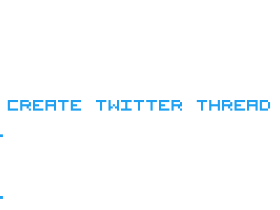

[](https://travis-ci.org/gdad-s-river/create-twitter-thread)

<!--  -->

<p align="center">
  
</p>

Logo Made With [Animated Pixel Gradients](https://animated-pixel-gradients.glitch.me/)

# create-twitter-thread

Put in a long string (a long tweet with > 280 (or less than or equal to) characters) and it will break it down for you in multiple chunks (each individual tweet <= 280 characters) array, so you can do anything with it, primarily like create a twitter thread in one go using twitter API for twitter bots. You can also create a twitter thread in response to somebody else's tweet (which might come from example listening to twitter's stream API for a particular keyword (hashtag, twitter tags, etc))

## Install

`npm install --save create-twitter-thread`

or

`yarn add create-twitter-thread`

## Test

`yarn/npm test`

---

## API

### createTwitterThreadMessages(messageString, twitterHandleObject[optional])

```javascript
const thread = createTwitterThreadMessages(
  messageString,
  twitterHandleObject[optional],
);
```

#### messageString

Type: `string`

String that needs to be broken down into <= 280 length tweets and assimilated in an array.

#### twitterHandleObject[optional]

Type: `object`

Shape:

```javascript
// intended — for an independent rant
// if you want to tag a particular person, you've to do it in the message
// in the first option above itself
{
  threadTo: {
    own: '@yourTwitterHandle';
  }
}

// if you want to reply to someone's tweet with a thread
// you got to keep tagging them to make a thread, the following
// takes care of it (also see sample example below)

{
  threadTo: {
    other: '@otherPersonHandle';
  }
}
```

#### thread (return value)

Type: `array of strings (your tweets)`

---

## USAGE

```javascript
const createTwitterThreadMessages = require('create-twitter-thread');

const longTwitterRant = `I'm partial to air conditioning.
God created pudding, and then he rested. I'm going to tell you something that I've never told anyone before. I have a dark side, too. Pretend. You pretend the feelings are there, for the world, for the people around you. Who knows? Maybe one day they will be.

I have a dark side, too. You look…perfect. God created pudding, and then he rested. Tell him time is of the essence. You all right, Dexter?

He taught me a code. To survive.
I am not a killer. Like a sloth. I can do that. I like seafood. Only you could make those words cute.

This man is a knight in shining armor.
Watching ice melt. This is fun.
I've lived in darkness a long time. Over the years my eyes adjusted until the dark became my world and I could see.
You look…perfect.
Watching ice melt. This is fun. Finding a needle in a haystack isn't hard when every straw is computerized. Somehow, I doubt that. You have a good heart, Dexter. I'm generally confused most of the time.

Watching ice melt. This is fun.
I have a dark side, too.
He taught me a code. To survive.
Pretend. You pretend the feelings are there, for the world, for the people around you. Who knows? Maybe one day they will be. He taught me a code. To survive. I'm not the monster he wants me to be. So I'm neither man nor beast. I'm something new entirely. With my own set of rules. I'm Dexter. Boo.

I've lived in darkness a long time. Over the years my eyes adjusted until the dark became my world and I could see. Cops, another community I'm not part of. I'm Dexter, and I'm not sure what I am. Cops, another community I'm not part of.

Tonight's the night. And it's going to happen again and again. It has to happen. Hello, Dexter Morgan. I will not kill my sister. I will not kill my sister. I will not kill my sister. I have a dark side, too.

I am not a killer. Pretend. You pretend the feelings are there, for the world, for the people around you. Who knows? Maybe one day they will be. I'm generally confused most of the time. Somehow, I doubt that. You have a good heart, Dexter.

I have a dark side, too. Keep your mind limber. I'm partial to air conditioning. This man is a knight in shining armor. I think he's got a crush on you, Dex! I'm really more an apartment person.

Watching ice melt. This is fun. I'm real proud of you for coming, bro. I know you hate funerals. Watching ice melt. This is fun. I think he's got a crush on you, Dex!

Tell him time is of the essence. I'm going to tell you something that I've never told anyone before. I will not kill my sister. I will not kill my sister. I will not kill my sister. Oh I beg to differ, I think we have a lot to discuss. After all, you are a client.

I'm thinking two circus clowns dancing. You? I like seafood. I'm really more an apartment person. I'm a sociopath; there's not much he can do for me. I'm Dexter, and I'm not sure what I am. Watching ice melt. This is fun.

Only you could make those words cute. Oh I beg to differ, I think we have a lot to discuss. After all, you are a client. I'm doing mental jumping jacks. I'm really more an apartment person.

I'm generally confused most of the time. He taught me a code. To survive. I love Halloween. The one time of year when everyone wears a mask … not just me. I'm going to tell you something that I've never told anyone before.

I will not kill my sister. I will not kill my sister. I will not kill my sister. I have a dark side, too. Hello, Dexter Morgan. I'm doing mental jumping jacks. He taught me a code. To survive.`;

const thread = createTwitterThreadMessages(longTwitterRant);
/*
  // you might want to scroll right 👉
	thread = [ 'I\'m partial to air conditioning.\nGod created pudding, and then he rested. I\'m going to tell you something that I\'ve never told anyone before. I have a dark side, too. Pretend. You pretend the feelings are there, for the world, for the people around you. Who knows? Maybe one day',
  'they will be.\n\nI have a dark side, too. You look…perfect. God created pudding, and then he rested. Tell him time is of the essence. You all right, Dexter?\n\nHe taught me a code. To survive.\nI am not a killer. Like a sloth. I can do that. I like seafood. Only you could make those',
  'words cute.\n\nThis man is a knight in shining armor.\nWatching ice melt. This is fun.\nI\'ve lived in darkness a long time. Over the years my eyes adjusted until the dark became my world and I could see.\nYou look…perfect.\nWatching ice melt. This is fun. Finding a needle in a haystack',
  'isn\'t hard when every straw is computerized. Somehow, I doubt that. You have a good heart, Dexter. I\'m generally confused most of the time.\n\nWatching ice melt. This is fun.\nI have a dark side, too.\nHe taught me a code. To survive.\nPretend. You pretend the feelings are there, for',
  'the world, for the people around you. Who knows? Maybe one day they will be. He taught me a code. To survive. I\'m not the monster he wants me to be. So I\'m neither man nor beast. I\'m something new entirely. With my own set of rules. I\'m Dexter. Boo.\n\nI\'ve lived in darkness a',
  'long time. Over the years my eyes adjusted until the dark became my world and I could see. Cops, another community I\'m not part of. I\'m Dexter, and I\'m not sure what I am. Cops, another community I\'m not part of.\n\nTonight\'s the night. And it\'s going to happen again and again. It',
  'has to happen. Hello, Dexter Morgan. I will not kill my sister. I will not kill my sister. I will not kill my sister. I have a dark side, too.\n\nI am not a killer. Pretend. You pretend the feelings are there, for the world, for the people around you. Who knows? Maybe one day they',
  'will be. I\'m generally confused most of the time. Somehow, I doubt that. You have a good heart, Dexter.\n\nI have a dark side, too. Keep your mind limber. I\'m partial to air conditioning. This man is a knight in shining armor. I think he\'s got a crush on you, Dex! I\'m really more',
  'an apartment person.\n\nWatching ice melt. This is fun. I\'m real proud of you for coming, bro. I know you hate funerals. Watching ice melt. This is fun. I think he\'s got a crush on you, Dex!\n\nTell him time is of the essence. I\'m going to tell you something that I\'ve never told',
  'anyone before. I will not kill my sister. I will not kill my sister. I will not kill my sister. Oh I beg to differ, I think we have a lot to discuss. After all, you are a client.\n\nI\'m thinking two circus clowns dancing. You? I like seafood. I\'m really more an apartment person.',
  'I\'m a sociopath; there\'s not much he can do for me. I\'m Dexter, and I\'m not sure what I am. Watching ice melt. This is fun.\n\nOnly you could make those words cute. Oh I beg to differ, I think we have a lot to discuss. After all, you are a client. I\'m doing mental jumping jacks.',
  'I\'m really more an apartment person.\n\nI\'m generally confused most of the time. He taught me a code. To survive. I love Halloween. The one time of year when everyone wears a mask … not just me. I\'m going to tell you something that I\'ve never told anyone before.\n\nI will not kill my',
  'sister. I will not kill my sister. I will not kill my sister. I have a dark side, too. Hello, Dexter Morgan. I\'m doing mental jumping jacks. He taught me a code. To survive.' ]
*/
```

---

```javascript
const thread = createTwitterThreadMessages(longString, {
  threadTo: { own: '@gdad_s_river' },
});

/*
 thread = [ 'I\'m partial to air conditioning.\nGod created pudding, and then he rested. I\'m going to tell you something that I\'ve never told anyone before. I have a dark side, too. Pretend. You pretend the feelings are there, for the world, for the people around you. Who knows? Maybe one day',
  '@gdad_s_river they will be.\n\nI have a dark side, too. You look…perfect. God created pudding, and then he rested. Tell him time is of the essence. You all right, Dexter?\n\nHe taught me a code. To survive.\nI am not a killer. Like a sloth. I can do that. I like seafood. Only you',
  '@gdad_s_river could make those words cute.\n\nThis man is a knight in shining armor.\nWatching ice melt. This is fun.\nI\'ve lived in darkness a long time. Over the years my eyes adjusted until the dark became my world and I could see.\nYou look…perfect.\nWatching ice melt. This is fun.',
  '@gdad_s_river Finding a needle in a haystack isn\'t hard when every straw is computerized. Somehow, I doubt that. You have a good heart, Dexter. I\'m generally confused most of the time.\n\nWatching ice melt. This is fun.\nI have a dark side, too.\nHe taught me a code. To',
  '@gdad_s_river survive.\nPretend. You pretend the feelings are there, for the world, for the people around you. Who knows? Maybe one day they will be. He taught me a code. To survive. I\'m not the monster he wants me to be. So I\'m neither man nor beast. I\'m something new entirely.',
  '@gdad_s_river With my own set of rules. I\'m Dexter. Boo.\n\nI\'ve lived in darkness a long time. Over the years my eyes adjusted until the dark became my world and I could see. Cops, another community I\'m not part of. I\'m Dexter, and I\'m not sure what I am. Cops, another community',
  '@gdad_s_river I\'m not part of.\n\nTonight\'s the night. And it\'s going to happen again and again. It has to happen. Hello, Dexter Morgan. I will not kill my sister. I will not kill my sister. I will not kill my sister. I have a dark side, too.\n\nI am not a killer. Pretend. You',
  '@gdad_s_river pretend the feelings are there, for the world, for the people around you. Who knows? Maybe one day they will be. I\'m generally confused most of the time. Somehow, I doubt that. You have a good heart, Dexter.\n\nI have a dark side, too. Keep your mind limber. I\'m',
  '@gdad_s_river partial to air conditioning. This man is a knight in shining armor. I think he\'s got a crush on you, Dex! I\'m really more an apartment person.\n\nWatching ice melt. This is fun. I\'m real proud of you for coming, bro. I know you hate funerals. Watching ice melt. This',
  '@gdad_s_river is fun. I think he\'s got a crush on you, Dex!\n\nTell him time is of the essence. I\'m going to tell you something that I\'ve never told anyone before. I will not kill my sister. I will not kill my sister. I will not kill my sister. Oh I beg to differ, I think we have a',
  '@gdad_s_river lot to discuss. After all, you are a client.\n\nI\'m thinking two circus clowns dancing. You? I like seafood. I\'m really more an apartment person. I\'m a sociopath; there\'s not much he can do for me. I\'m Dexter, and I\'m not sure what I am. Watching ice melt. This is',
  '@gdad_s_river fun.\n\nOnly you could make those words cute. Oh I beg to differ, I think we have a lot to discuss. After all, you are a client. I\'m doing mental jumping jacks. I\'m really more an apartment person.\n\nI\'m generally confused most of the time. He taught me a code. To',
  '@gdad_s_river survive. I love Halloween. The one time of year when everyone wears a mask … not just me. I\'m going to tell you something that I\'ve never told anyone before.\n\nI will not kill my sister. I will not kill my sister. I will not kill my sister. I have a dark side, too.',
  '@gdad_s_river Hello, Dexter Morgan. I\'m doing mental jumping jacks. He taught me a code. To survive.' ]
*/
```

---

```javascript
const thread = createTwitterThreadMessages(longString, {
  threadTo: { other: '@otherTwitterHandle' },
});

/*
thread = [ '@otherTwitterHandle I\'m partial to air conditioning.\nGod created pudding, and then he rested. I\'m going to tell you something that I\'ve never told anyone before. I have a dark side, too. Pretend. You pretend the feelings are there, for the world, for the people around you. Who',
  '@otherTwitterHandle knows? Maybe one day they will be.\n\nI have a dark side, too. You look…perfect. God created pudding, and then he rested. Tell him time is of the essence. You all right, Dexter?\n\nHe taught me a code. To survive.\nI am not a killer. Like a sloth. I can do that. I',
  '@otherTwitterHandle like seafood. Only you could make those words cute.\n\nThis man is a knight in shining armor.\nWatching ice melt. This is fun.\nI\'ve lived in darkness a long time. Over the years my eyes adjusted until the dark became my world and I could see.\nYou',
  '@otherTwitterHandle look…perfect.\nWatching ice melt. This is fun. Finding a needle in a haystack isn\'t hard when every straw is computerized. Somehow, I doubt that. You have a good heart, Dexter. I\'m generally confused most of the time.\n\nWatching ice melt. This is fun.\nI have a',
  '@otherTwitterHandle dark side, too.\nHe taught me a code. To survive.\nPretend. You pretend the feelings are there, for the world, for the people around you. Who knows? Maybe one day they will be. He taught me a code. To survive. I\'m not the monster he wants me to be. So I\'m',
  '@otherTwitterHandle neither man nor beast. I\'m something new entirely. With my own set of rules. I\'m Dexter. Boo.\n\nI\'ve lived in darkness a long time. Over the years my eyes adjusted until the dark became my world and I could see. Cops, another community I\'m not part of. I\'m',
  '@otherTwitterHandle Dexter, and I\'m not sure what I am. Cops, another community I\'m not part of.\n\nTonight\'s the night. And it\'s going to happen again and again. It has to happen. Hello, Dexter Morgan. I will not kill my sister. I will not kill my sister. I will not kill my',
  '@otherTwitterHandle sister. I have a dark side, too.\n\nI am not a killer. Pretend. You pretend the feelings are there, for the world, for the people around you. Who knows? Maybe one day they will be. I\'m generally confused most of the time. Somehow, I doubt that. You have a good',
  '@otherTwitterHandle heart, Dexter.\n\nI have a dark side, too. Keep your mind limber. I\'m partial to air conditioning. This man is a knight in shining armor. I think he\'s got a crush on you, Dex! I\'m really more an apartment person.\n\nWatching ice melt. This is fun. I\'m real proud',
  '@otherTwitterHandle of you for coming, bro. I know you hate funerals. Watching ice melt. This is fun. I think he\'s got a crush on you, Dex!\n\nTell him time is of the essence. I\'m going to tell you something that I\'ve never told anyone before. I will not kill my sister. I will not',
  '@otherTwitterHandle kill my sister. I will not kill my sister. Oh I beg to differ, I think we have a lot to discuss. After all, you are a client.\n\nI\'m thinking two circus clowns dancing. You? I like seafood. I\'m really more an apartment person. I\'m a sociopath; there\'s not much',
  '@otherTwitterHandle he can do for me. I\'m Dexter, and I\'m not sure what I am. Watching ice melt. This is fun.\n\nOnly you could make those words cute. Oh I beg to differ, I think we have a lot to discuss. After all, you are a client. I\'m doing mental jumping jacks. I\'m really more',
  '@otherTwitterHandle an apartment person.\n\nI\'m generally confused most of the time. He taught me a code. To survive. I love Halloween. The one time of year when everyone wears a mask … not just me. I\'m going to tell you something that I\'ve never told anyone before.\n\nI will not',
  '@otherTwitterHandle kill my sister. I will not kill my sister. I will not kill my sister. I have a dark side, too. Hello, Dexter Morgan. I\'m doing mental jumping jacks. He taught me a code. To survive.' ]
*/
```
